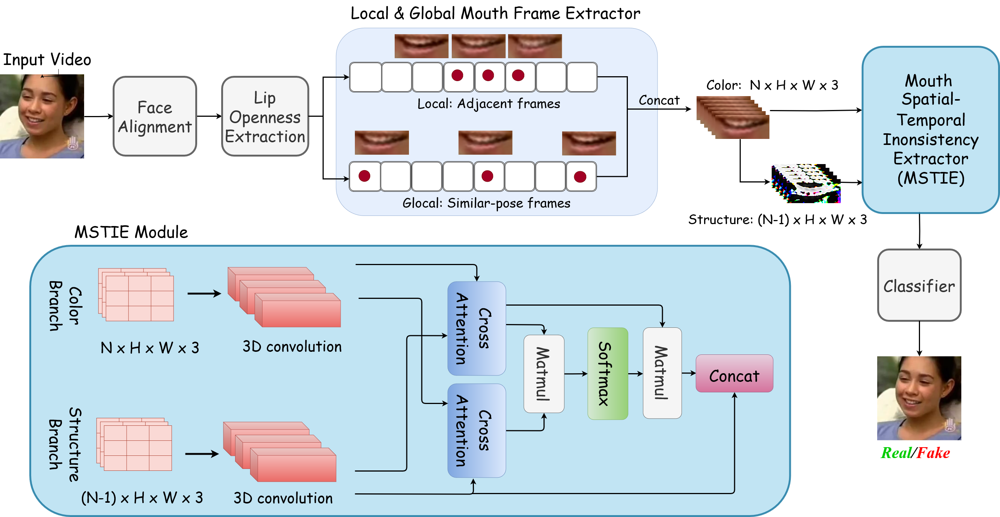

# EXPOSING LIP-SYNCING DEEPFAKES FROM MOUTH INCONSISTENCIES
Soumyya Kanti Datta, Shan Jia, Siwei Lyu

Accepted by ICME 2024
### [Paper](https://arxiv.org/abs/2401.10113) 

## Abstract
A lip-syncing deepfake is a digitally manipulated video in which a person's lip movements are created convincingly using AI models to match altered or entirely new audio. Lip-syncing deepfakes are a dangerous type of deepfakes as the artifacts are limited to the lip region and more difficult to discern. In this paper, we describe a novel approach, LIP-syncing detection based on mouth INConsistency (LIPINC), for lip-syncing deepfake detection by identifying temporal inconsistencies in the mouth region. These inconsistencies are seen in the adjacent frames and throughout the video. Our model can successfully capture these irregularities and outperforms the state-of-the-art methods on several benchmark deepfake datasets. 



# Prerequisites
- `Python 3.10` 
- Install necessary packages using `pip install -r requirements.txt`.
- Download the dlib’s pre-trained facial landmark detector from [here](https://drive.google.com/file/d/1-Uc2rH1tiKZEh9NwmgmBFZT_6xDvGBSD/view?usp=sharing) and put it in the same folder as demo.py.
- Download LipInc model weights from [here](https://drive.google.com/file/d/1V6eUVVHaLs_QxdqKl8HHhkNTTj9Uaz_L/view?usp=sharing) and place it under ./checkpoints folder

# Inference: Lip-syncing videos detection using the pre-trained models 

The input_video should be in mp4 format :
```
python demo.py --input_path {input_video_path} --output_path {output_path}
```
The demo video is saved (by default) as `{input_video_name}_demo.mp4`.


# Citation
```
@article{datta2024exposing,
  title={Exposing Lip-syncing Deepfakes from Mouth Inconsistencies},
  author={Datta, Soumyya Kanti and Jia, Shan and Lyu, Siwei},
  journal={arXiv preprint arXiv:2401.10113},
  year={2024}
}
```

# Acknowledgements
This work is supported by the US Defense Advanced Research Projects Agency (DARPA) Semantic Forensic (SemaFor) program, under Contract No.HR001120C0123, and the Center for Identification Technology Research and the National Science Foundation underGrant No. 1822190. The views, opinions and/or findings expressed are those of the author and should not be interpretedas representing the official views or policies of the Department of Defense, the National Science Foundation, or the U.S. Government.

